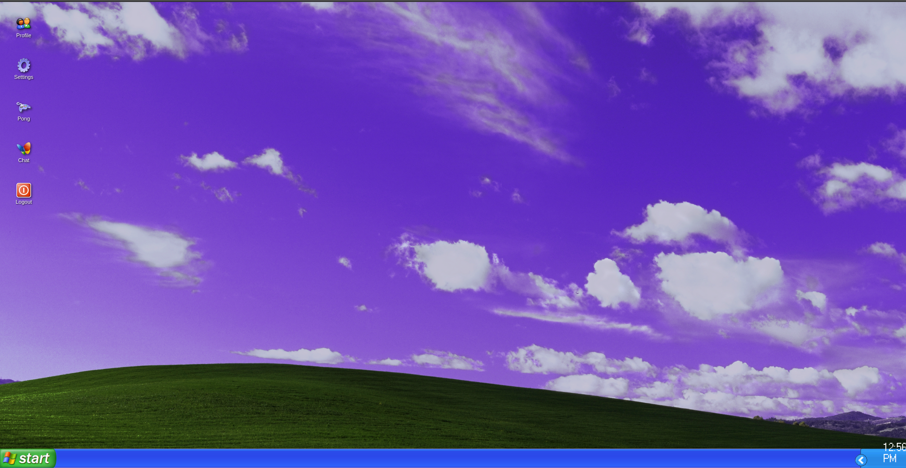
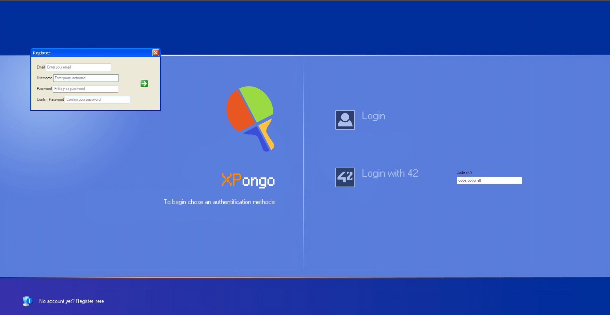
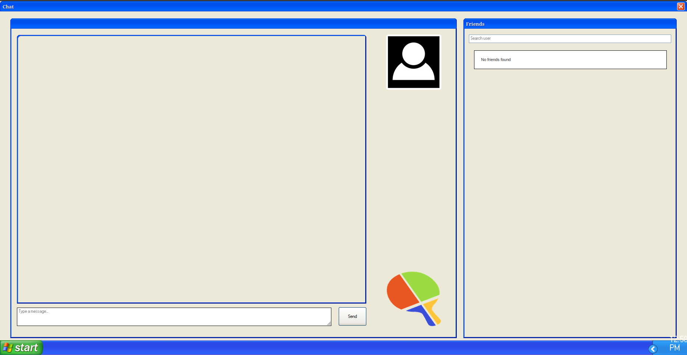

# ft_transcendence

## 📋 À propos

ft_transcendence est le dernier projet du cursus commun de l'école 42. C'est un projet web qui consiste à créer un site permettant aux utilisateurs de jouer au Pong en temps réel avec d'autres joueurs, avec un système de chat et de matchmaking. Notre version propose une expérience nostalgique avec une interface inspirée de Windows XP ! ��

## 🖼️ Aperçu du Projet

### Page d'accueil Windows XP


### Page de Connexion


### Chat Style MSN


## 🎬 Démo du Jeu

https://github.com/user-attachments/assets/ab6e79fb-674f-4bbf-9d78-b39f7c0f7abc

## 🎯 Fonctionnalités principales

- **Interface Windows XP** : Une reproduction fidèle de l'interface iconique de Windows XP
- **Authentification** via le système OAuth de 42
- **Jeu de Pong** en temps réel dans le style rétro
- **Chat** avec création de canaux publics/privés, inspiré du style MSN Messenger
- **Profil utilisateur** personnalisable
- **Système de matchmaking** et classement
- **Interface responsive** et moderne, tout en gardant l'esprit Windows XP

## 🛠 Stack technique

- **Backend** : Python
- **Base de données** : PostgreSQL
- **Cache** : Redis
- **Reverse Proxy** : Nginx
- **Conteneurisation** : Docker & Docker Compose

## 🎮 Comment lancer le projet

1. Assurez-vous d'avoir Docker et Docker Compose installés
2. Clonez le repository
3. Créez un fichier .env avec les variables nécessaires
4. Lancez le projet :
```bash
docker-compose up --build
```

## 👥 Équipe

- [SefirOutin](https://github.com/SefirOutin)
- [molomol0](https://github.com/molomol0)
- [Bilou0412](https://github.com/Bilou0412)

## 📊 Note

125/100 🎉

